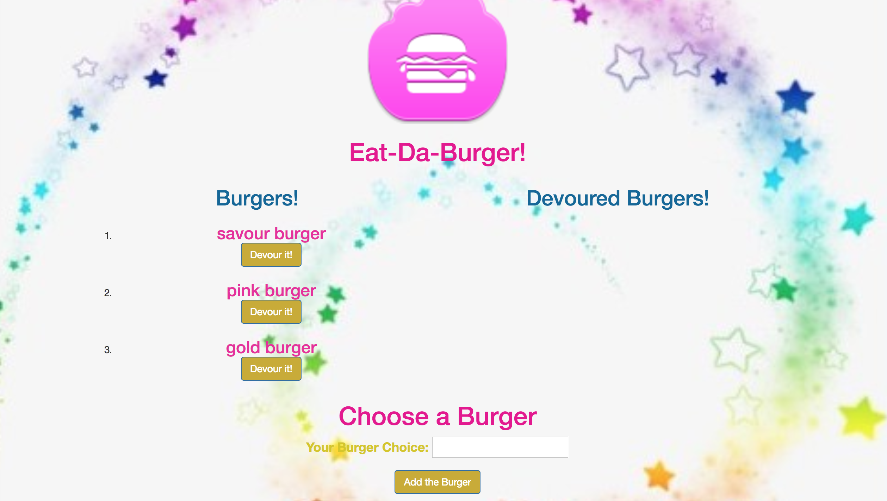

# Burger app / burgerHandlebars app
A restaurant app where users input the names of burgers they'd like to eat, built with:

* MySQL and Node (to query and route data),
* Express Handlebars (to generate html content),
* ORM to convert data,
* MVC design pattern to separate application's concerns.

Deployed in HEROKU @ https://burgerhandlebars.herokuapp.com

### Highlights

* Eat Da Burger -simply called the burger app- is a restaurant app that lets users input the names of burgers they'd like to eat. 

* Whenever a user submits a burger's name, the app displays the burger on the left side of the page, waiting to be devoured.

* Each burger in the waiting area has a `Devour it!` button. When the user clicks it, the burger moves to the right side of the page.

* Each burger in the devoured area has a `Savor this burger!` button. When the user clicks it, the burger is completely digested, being deleted from the page.

### Key Concepts

This is a `one single page` app that stores every burger in a database, whether devoured or not. The burgers are deleted from the database when the burger is savored - when the user hits the `Savor this button!` button.

##### The app requires node.JS, including npm dependencies:

* Node.js 
* body-parser NPM - https://www.npmjs.com/package/inquirer
* express NPM Package - https://www.npmjs.com/package/express
* express-handlebars (Handlebars view engine for Express) - https://www.npmjs.com/package/express-handlebars
* nodemon - https://www.npmjs.com/package/nodemon
* MySql database 
* method-override - https://www.npmjs.com/package/method-override

In your terminal run node server, which shall return the PORT: 8000. Then, run the app in your local browser @ http://localhost:8000/ . Alternatively, play this app in HEROKU: https://burgerhandlebars.herokuapp.com/ .

##### The app is enhanced with two features: (1)Refesh and (2) My GitHub Repo, at the footer of the page.

#### How can I make it better? Review for dry code.

---

* **Angelina Davies – July 2018** - *ExpressHandlebars/MySql/CSS/JS/Node.js* - [Angelina Davies](https://github.com/angelyna)

